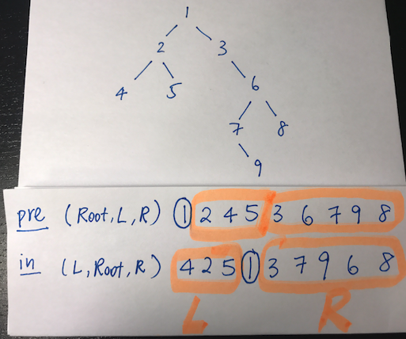

# ARTS02-20181014

# Algorithm 

OJ website : [105. Construct Binary Tree from Preorder and Inorder Traversal](https://leetcode.com/problems/construct-binary-tree-from-preorder-and-inorder-traversal/description/)

### Description

```
Given preorder and inorder traversal of a tree, construct the binary tree.

Note:
You may assume that duplicates do not exist in the tree.

For example, given

preorder = [3,9,20,15,7]
inorder = [9,3,15,20,7]
Return the following binary tree:

    3
   / \
  9  20
    /  \
   15   7
```

### My Idea




Looking at preorder traversal, the first value (node 1) must be the root.
Then, we find the index of root within in-order traversal, and split into two sub problems.

### Solution in C++

```c++
struct TreeNode {
	int val;
	TreeNode *left;
	TreeNode *right;
	TreeNode(int x) : val(x), left(NULL), right(NULL) {}
};

class Solution {
public:
	TreeNode* reConstructBinaryTree(vector<int> pre,vector<int> vin) {
		if (pre.empty() || vin.empty()) {
			return NULL;
		}
		vector<int> pre_left, pre_right, vin_left, vin_right;
		int rootValue = pre[0];
		int count = 0;
		for (int i=0;i<vin.size();++i) {
			if (rootValue == vin[i]) {
				break;
			}
			++count;
		}

		for (int i=1;i<pre.size();++i) {
			if (i<=count) pre_left.push_back(pre[i]);
			if (i>count) pre_right.push_back(pre[i]);
		}
		
		for (int i=0;i<vin.size();++i) {
			if (i<count) vin_left.push_back(vin[i]);
			if (i>count) vin_right.push_back(vin[i]);
			
		}
		TreeNode *tree = new TreeNode(rootValue);
		tree->left = reConstructBinaryTree(pre_left, vin_left);
		tree->right = reConstructBinaryTree(pre_right, vin_right);
		return tree;
	}
	
};
```

### Solution in C

```c
struct TreeNode {
	int val;
	struct TreeNode *left;
	struct TreeNode *right;
};

struct TreeNode* buildTree(int* preorder, int preorderSize, int* inorder, int inorderSize) {
	if (!preorderSize || preorderSize != inorderSize) return 0;
	int value = preorder[0];
	int pos = 0;
	for (int i=0;i<inorderSize;++i) {
		if (preorder[0] == inorder[i]) 
			break;
		++pos;
	}
	struct TreeNode *tree = (struct TreeNode *)malloc(sizeof(struct TreeNode));
	tree->val = value;
	tree->left = buildTree(preorder+1, pos, inorder, pos);
	tree->right = buildTree(preorder+pos+1, preorderSize-pos-1, inorder+pos+1, preorderSize-pos-1);
	return tree;
}
```

# Review

[ABC: Always Be Coding](https://medium.com/always-be-coding/abc-always-be-coding-d5f8051afce2)

I get some precious experience from the article.the author speak six tips, I summary it:

1. ABC --- Always be coding , I will develop a portfolio in github.The more you code , the better you get.I will upload my project to github , and rich it.
2. Master a multy-paradigm language , for example : C++,python.
3. Know thy complexities.
4. Re-invent the wheel, it will help us to understand underlying principle deeply.
5. Solve word problems.“Repetition doesn’t spoil the prayer.”
6. Make coding easy.Google is basically all about coding at a whiteboard, I will practice to coding at a whiteboard by myself.

I hope I will keep ABC, I will coding every day , nevertheless, nothing is easy.

# Tip

一、用途：

众所周知，很多时候我们需要设置两个圆角，设置控件的圆角使用layer.cornerRadius属性即可，但是这样设置成的结果是4个边角都是圆角类型。

利用班赛尔曲线画角：

```objective-c
UIBezierPath *bezierPath = [UIBezierPath bezierPathWithRoundedRect:button.bounds byRoundingCorners:(UIRectCornerBottomLeft |UIRectCornerBottomRight) cornerRadii:CGSizeMake(10, 10)];
CAShapeLayer *shapeLayer = [[CAShapeLayer alloc] init];
shapeLayer.frame = button.bounds;
shapeLayer.path = bezierPath.CGPath;
button.layer.mask = shapeLayer;
```
关于设置指定位置控件圆角的枚举：

```objective-c
typedef NS_OPTIONS(NSUInteger, UIRectCorner) {
    UIRectCornerTopLeft     = 1 << 0, //左上
    UIRectCornerTopRight    = 1 << 1, //右上
    UIRectCornerBottomLeft  = 1 << 2, //左下
    UIRectCornerBottomRight = 1 << 3, //右下
    UIRectCornerAllCorners  = ~0UL    //全角
};
```

我的用法如下：

```objective-c
        UIBezierPath *maskPathA = [UIBezierPath bezierPathWithRoundedRect:_smsCodeTFiled.bounds byRoundingCorners:UIRectCornerBottomLeft | UIRectCornerTopLeft cornerRadii:CGSizeMake(self.smsCodeTFiled.bounds.size.height/2.0, self.smsCodeTFiled.bounds.size.height/2.0)];
        CAShapeLayer *maskLayerA = [[CAShapeLayer alloc] init];
        maskLayerA.frame = _smsCodeTFiled.bounds;
        maskLayerA.path = maskPathA.CGPath;
        _smsCodeTFiled.layer.mask = maskLayerA;
        _smsCodeTFiled.layer.masksToBounds = YES;
        [self.view bringSubviewToFront:self.smsCodeLb];
```
二、我的想法

这个用法主要用于在左边有圆角，右边没有，或者相反的状况，但是注意一下就是，当设置多个UIView时，要记得不要声明相同的名称，例如   UIBezierPath *maskPath  后面声明其他UIview的时候也这么写  UIBezierPath *maskPath    就会出错了，记得不要重复声明同一个名称的对象就好。如果此方法没有生效，很大可能是Xib文件加了约束导致此方法不能生效。

三、思考与行动

1.尝试不用纯代码，利用Xib 能否使这某个UIView 指定位置设置圆角？

2.尝试通过其他方法，来设置UIVIew指定位置圆角，你能想到几种方法？感觉那种最好用？哪种最不消耗内存。

# Share

## 


