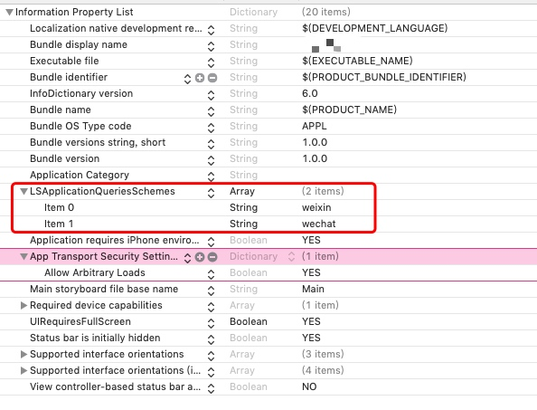

# ARTS06-20181228

# Algorithm 

### OJ address

Leetcode website : [4. Median of Two Sorted Arrays](https://leetcode.com/problems/median-of-two-sorted-arrays/submissions/)

### Description

There are two sorted arrays nums1 and nums2 of size m and n respectively.

Find the median of the two sorted arrays. The overall run time complexity should be O(log (m+n)).

You may assume nums1 and nums2 cannot be both empty.

Example 1:

nums1 = [1, 3]
nums2 = [2]

The median is 2.0
Example 2:

nums1 = [1, 2]
nums2 = [3, 4]

The median is (2 + 3)/2 = 2.5

### Solution in C

第一种解法：

```c
#include <stdio.h>
int a[5000];

double findMedianSortedArrays(int* nums1, int nums1Size, int* nums2, int nums2Size) {
	int index1 = 0;
	int index2 = 0;
	int index3 = 0;
	while(index1<nums1Size && index2<nums2Size) {
		if (nums1[index1]<nums2[index2]) {
			a[index3++] = nums1[index1++];
		}
		else {
			a[index3++] = nums2[index2++];
		}
	}
	while (index1<nums1Size) {
		a[index3++] = nums1[index1++];
	}
	while (index2<nums2Size) {
		a[index3++] = nums2[index2++];
	}
	if ((index3 % 2) != 0) {
		return a[(index3-1)/2];
	}
	else {
		return (a[index3/2]+a[index3/2-1])/2.0;
	}	
}

int main(int argc, char const *argv[])
{
	int c[2] = {1,3};
	int b[2] = {2};
	double dd = findMedianSortedArrays(c,2,b,1);
	printf("dd:%g\n", dd);
	return 0;
}
```

第二种解法：

```c
double findMedianSortedArrays(int* nums1, int nums1Size, int* nums2, int nums2Size) {
	int index1, index2, index3, index5, index6, res, resA, resB;
	index1 = index2 = index3 = index5 = index6 = res = resA = resB = 0;
	int length = nums1Size + nums2Size;
	if (length%2!=0) {
		index5 = (length-1)/2;
        index6 = 0;
	}
    else {
    	index5 = res = length/2;
    	index6 = length/2-1;
    }
    for (int i=0;i<length;++i) {
    	if (index1<nums1Size && index2<nums2Size) {
    		if (nums1[index1] < nums2[index2]) res = nums1[index1++];
    		else res = nums2[index2++];
    	}
    	else if (index1<nums1Size) res = nums1[index1++];
    	else res = nums2[index2++];
    	if (i == index5) resA = res;
    	if (i == index6) resB = res;
    }
    return (length%2!=0) ? resA : ((resA + resB)/2.0);
}
```

### Solution in Python

```python
class Solution(object):
    def findMedianSortedArrays(self, nums1, nums2):
        i = 0
        j = 0
        length = len(nums1)+len(nums2)
        if length%2!=0:
            res = (length-1)/2
            respre = 0
        else:
            res = length/2
            respre = length/2-1
        for x in range(length):
            if i < len(nums1) and j < len(nums2):
                if nums1[i] < nums2[j]:
                    dd = nums1[i]
                    i = i+1
                else:
                    dd = nums2[j]
                    j = j+1
            elif i < len(nums1):
                dd = nums1[i]
                i = i+1
            elif j < len(nums2):
                dd = nums2[j]
                j = j+1
            if x == res:
                resA = dd
                break
            if x == respre:
                resB = dd
        if length%2!=0: 
            return resA   
        else: 
            return (resA + resB)/2.0
        
if __name__ == '__main__':
    a = Solution()
    d1 = [1,2]
    d2 = [3]
    c = a.findMedianSortedArrays(d1,d2)
    print c
```

### My Idea

题目含义是，给定两个大小为 m 和 n 的有序数组 nums1 和 nums2 。请找出这两个有序数组的中位数。要求算法的时间复杂度为 O(log (m+n)) 。

关于复杂度的理解就是，不要用排序去做，一次遍历解决这道题目，其实不用一遍遍历也可以解决这个题目，我写了两个解法:

1. 第一种解法就是全部遍历，在遍历的时候比较两个数组每各元素的大小，将最小的元素存到新的数组中，然后遍历结束，在新的数组中找到中位数即可。算法的时间复杂度是O（m+n）
2. 显然第一种解法是全部遍历，但是还有更好的方法，就是不用开数组，仅仅比较给到的两个数组，由于给到的数组长度是题目给你的，那中位数的位置也是固定的了，其实就是比较两个数组，一直比较到中位数的那个位置，然后保存中位数，直接返回结果就可以了。中位数的位置就是两个数组中间的位置。所以时间复杂度是O（(m+n)/2）,比第一种方法快一倍。而且不用开数组保存，大大的节约了空间复杂度。只要开变量保存结果就可以了。

# Review

### English Article

[Using Google Maps costs more than you think.](https://medium.com/swlh/using-google-maps-costs-more-than-you-think-d62c7d857b2d)

Many Apps collect our personal information, when we need the function from apps , we will pay our personal information, this is an equal quantity exchange. 

However, a large of people think money is more important than data privacy. what's more, people don't understand that Apps are collecting our data sometime. people don't pay attention to the significance of data privacy. Because We can't measure data privacy by money.

Soon after, data privacy is becoming more and more important, we will spend a large money buying data which apps collecting.Our data is becoming more and more important in future.

One day, our routine life and schedule will be known by most of people, however we never know it.

### Chinese Article

[跨平台開發的一些姿勢](https://medium.com/@kingapol/%E8%B7%A8%E5%B9%B3%E5%8F%B0%E9%96%8B%E7%99%BC%E7%9A%84%E4%B8%80%E4%BA%9B%E5%A7%BF%E5%8B%A2-e2a59b7849ce)

这篇主要介绍了Cordova、Xamarin、NativeScript、React Native、Electron、Flutter这些跨平台移动端技术。

关于Cordova的跨平台Solution,我认为是目前最好的跨平台解决方案。尤其是ionic，已经看起来和大部分原生app一样了。ionic4控件做的相当完美，当然也会有一些小的不足，可以通过原生插件来进行修补。毕竟ionic，安卓端、iOS端、网站端、小程序端通吃，成为了最适合的跨平台框架。“write once, run everywhere”.

React Native,要和原生相结合，没办法自己写pugin，要依赖第三方的特性。不过作为一个跨平台的过渡框架，可以说应有尽有了。虽然还不够完美，但是高擴展性以及广大的社群支撐，这也成了一个好框架很大的优势所在。

Flutter，Google的亲儿子，有点不用多少，一定是跨平台框架中最接近原生的一种框架，也是效率最高的。不过好像只能应用在移动端，也就是安卓端，iOS端，无法放在小程序或者浏览器中运行？通过这点来看，还是无法真正的替代ionic框架。没有了JS广大的社区,Dart 语言社区现在好像还没那么完善，估计还要至少一年的发展时间才能成型。

# Tips

## iOS中点击按钮跳转微信小程序

### 需求

在iOS的UIWebView界面，点击button，直接打开微信跳转到微信小程序。

### 实现方式

1. 接入微信SDK,pod中增加下面一句话

pod 'WechatOpenSDK'

2. AppDelegate文件导入<WechatOpenSDK/WXApi.h>并实现代理 <WXApiDelegate>

初始化你的微信WXAPI，增加代理的时候，会报警告，"Implementing deprecated method",由于微信没有更新API，就只能用之前版本废了的方法，所以暂时就忽略警告吧，如果微信改了的话，请及时通知我。

```objectivec
- (BOOL)application:(UIApplication *)application didFinishLaunchingWithOptions:(NSDictionary *)launchOptions {
    [WXApi registerApp:@"wxf691476627360000"];//ID为你申请的微信开放ID
}

- (BOOL)application:(UIApplication *)application handleOpenURL:(nonnull NSURL *)url
{
    return [WXApi handleOpenURL:url delegate:self];
}

- (BOOL)application:(UIApplication *)app openURL:(NSURL *)url sourceApplication:(nullable NSString *)sourceApplication annotation:(nonnull id)annotation
{
    return [WXApi handleOpenURL:url delegate:self];
}

-(void) onReq:(BaseReq*)req
{
    NSLog(@"req : %@", req);
}

-(void) onResp:(BaseResp*)resp
{
    NSLog(@"req : %@", resp);
}
```

3. WKWebView代理

```objectivec
- (void)webView:(WKWebView*)webView decidePolicyForNavigationAction:(WKNavigationAction*)navigationAction decisionHandler:(void(^)(WKNavigationActionPolicy))decisionHandler{
    
    WKNavigationActionPolicy policy = WKNavigationActionPolicyAllow;
    // 之前是打开直接跳转APPSOTRE，所以要WKWebView要加上这句话，才能贴砖到APPSTORE商店
    if([[navigationAction.request.URL host] isEqualToString:@"itunes.apple.com"] && [[UIApplication sharedApplication] openURL:navigationAction.request.URL]){
        policy = WKNavigationActionPolicyCancel;
        
    }
    decisionHandler(policy);
}

- (void)userContentController:(WKUserContentController *)userContentController didReceiveScriptMessage:(WKScriptMessage *)message
{
    if ([message.name isEqualToString:@"OpenWxMinFunc"]) {
        [_webView loadRequest:[NSURLRequest requestWithURL:[NSURL URLWithString:message.body]]];
        [Tools enter_weixin_miniProgramid:@“填写申请的小程序名称” path:@“填写路径”];
    }
}

- (void)webView:(WKWebView *)webView didFinishNavigation:(null_unspecified WKNavigation *)navigation
{
    [_hud hideAnimated:YES];
}

- (void)webView:(WKWebView *)webView didFailNavigation:(null_unspecified WKNavigation *)navigation withError:(NSError *)error
{
    [_hud hideAnimated:YES];
    [self goBack];
}

- (void)gobackVoid
{
    [self goBack];
}

- (void)goBack
{
    id vc = [self.navigationController popViewControllerAnimated:YES];
    if (nil == vc) {
        [self dismissViewControllerAnimated:YES completion:^{
            // 无事件处理
        }];
    }
}

- (WKWebView *)webView
{
    if (!_webView) {
        WKWebViewConfiguration *config = [[WKWebViewConfiguration alloc]init];
        config.preferences = [[WKPreferences alloc]init];
        config.preferences.minimumFontSize = 10;
        config.preferences.javaScriptEnabled = YES;
        config.preferences.javaScriptCanOpenWindowsAutomatically = NO;
        config.userContentController = [[WKUserContentController alloc] init];
        config.processPool = [[WKProcessPool alloc] init];
        [config.userContentController addScriptMessageHandler:self name:@"OpenWxMinFunc"];
        
        _webView = [[WKWebView alloc] initWithFrame:CGRectZero configuration:config];
        _webView.backgroundColor = [UIColor whiteColor];
        _webView.scrollView.bounces = YES;
        NSURL *url = [NSURL URLWithString:@"https://dddd.net/ddd/song_app_list.html"];// 填写你的网址URL
        [_webView loadRequest:[NSURLRequest requestWithURL:url]];
        _webView.navigationDelegate = self;
    }
    return _webView;
}
```


4. 微信小程序跳转方法：

```objectivec
+ (void)enter_weixin_miniProgramid:(NSString *)userName path:(NSString *)path
{
    if (![WXApi isWXAppInstalled]) {
        [self showMessage:@"您未安装微信，请先安装微信"];
        return;
    }
    WXLaunchMiniProgramReq *launchMini = [WXLaunchMiniProgramReq object];
    launchMini.userName = userName;
    launchMini.path = path;
    launchMini.miniProgramType = WXMiniProgramTypeRelease;
    [WXApi sendReq:launchMini];
}
```

5. 修改info.plist，增加一条：

<key>LSApplicationQueriesSchemes</key>
<array>
 <string>weixin</string>
 <string>wechat</string>
</array>

效果如图:




### 思考与总结：

1. 这是App拉起小程序，请问如果用小程序拉起APP？是通过onResp回调么？
2. [config.userContentController addScriptMessageHandler:self name:@"OpenWxMinFunc"]，在WKWebView要配置这一条，才能和H5前端联调，请问OpenWxMinFunc这个字段是干嘛用的？

# Shares

目标和系统

今天朋友圈被网易刷屏了，2019我的新年FLAG.这也就是写一下今年的目标。刚好谈一下目标这个话题。

亚当斯是罗伯特漫画的作者，当年一边工作一边业余画画和写作，给他带来的物质回报非常少，大概相当于工资的5%，对生活没有任何影响，很多认为他为啥做这些事情，他说，不是为了完成一个什么具体的目标，而是为了发展一个系统。而所谓的系统则是连续变化的东西，或者是一项技能，或者是一项关系。

博客写作就是一个系统，ARTS也是一个系统，具体那篇文章有没有人看，并不关注，重要的是这个系统不断的发展，写ARTS没有任何具体的目标，这恰恰是系统的特征。怎么发展系统呢？

1. 定期写
2. 测试自己不同方面的写作，找到更适合读者的方法，怎么写才能让人看懂。

系统有了，一切都会自然发生。。。这也是相信陈浩老师让我们写ARTS的原因。

如果想取得出类拔萃的成就大概有两个选择：

1. 把某个技能练到全世界最好
2. 你可以选择两个技能，把每一项技能练到世界前25%的水平

如果做一个TOP25%的程序员，有同时是一个TOP25的演讲者，那天生就是其他程序员的领导呀。

关于系统，其实是一个气度问题，因为没有多少人会没有职业规划，不计回报的长时间发展一个系统，ARTS就是一个系统。气度是个被忽略了的气质，不计较得失，心里有一件大事，我特别佩服这些有气度的人。

只要发展两项技能，维持到世界前25%的水平，这是绝对收益终生的系统。


