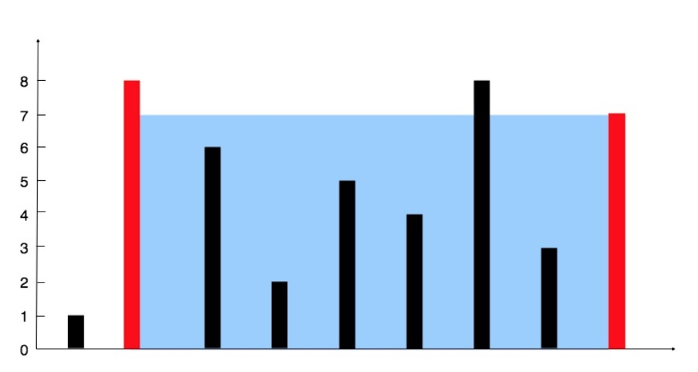

# ARTS11-20190126

# Algorithm 

### OJ address

Leetcode website : [11. Container With Most Water](https://leetcode.com/problems/container-with-most-water/)

### Description

Given n non-negative integers a1, a2, ..., an , where each represents a point at coordinate (i, ai). n vertical lines are drawn such that the two endpoints of line i is at (i, ai) and (i, 0). Find two lines, which together with x-axis forms a container, such that the container contains the most water.

Note: You may not slant the container and n is at least 2.




The above vertical lines are represented by array [1,8,6,2,5,4,8,3,7]. In this case, the max area of water (blue section) the container can contain is 49.

Example:

Input: [1,8,6,2,5,4,8,3,7]
Output: 49


### Solution in C (one)

```c
int maxArea(int* height, int heightSize) {
	int max = 0;
	for (int i = 0; i < heightSize; ++i) {
		int left = i-0;
		int right = heightSize-i-1;
		int l = 0; 
		int r = heightSize-1;
		int tmp = 0;
		while(r > i | l < i) {
			if (left < right && i<r) {
				if (height[r] >= height[i]) {
					tmp = (r-i)*height[i];
					printf("a[%d],a[%d]->%d\n", r, i, tmp);
					break;
				}
				--r;--right;
			}
			else if (left > right && l<i) {
				if (height[l] >= height[i]) {
					tmp = (i-l)*height[i];
					printf("a[%d],a[%d]->%d\n", l, i, tmp);
					break;
				}
				++l;++left;
			}
			else {
				break;
			}
		}
		max = max>tmp ? max: tmp;
	}
	return max;
}

int main(int argc, char const *argv[])
{
	int a[9] = {1,2,3,4,5,4,3,2,1};
	// int a[4] = {1,2,4,3};
	printf("%d\n", maxArea(a, 9));
	return 0;
}
```

### Solution in C (two)

```c
int maxArea(int* height, int heightSize) {
	int max = 0;
	int left = 0;
	int right = heightSize-1;
	int sum = 0;
	while (left < right) {
		if (height[left] < height[right]) {
			sum = height[left] * (right - left);
			++left;
		}
		else {
			sum = height[right] * (right - left);
			--right;
		}
		max = max > sum ? max : sum;
	}
	return max;
}
```

### My Idea

第一种 刚开始，我想的并非是O（n）的方法，是O（n*n）情况下的剪枝方法，打败了50%的people，这个方法就是先选一个长度固定线，然后从最左边和最右边找到最远的比这个固定高度的线还要高的线，找到后，算出两线之间的面积就是这个固定长度线的最大面积，然后再去找其他线，以此类推将求出所有线的最大面积，得出这个答案。这个方法可以AC，但是不是O（n），所以只能达到50%的AC速度。

第二种 O（n）的算法:

1. 初始化最大面积(max_area)以及右边(right)、左边(left)的线，left为0，right则为最右边的线，
2. 两线的长度为 right — left ，求出面积，若面积大于max_area，就取代max_area
3. 比较两条线长度，若左边小，左边的线往右移 left + 1，反之右边的线往左移 right — 1
然后继续从 第 2 点开始，直到left == right。

# Review

[How to run a React Native app on iOS](https://medium.freecodecamp.org/how-to-run-a-react-native-app-on-ios-fc427be3c375)

Nice article, I try to run react-native in Mac by this way, and I success to launch it on a simulator, the action of trying it is easy, but what happen when we run a simple `react-native run-ios` command is so important.

I like author's mind from the bottom up, We need to think the principle behind things were done from the bottom up.


# Tips

今天没有技术tips，就说下人生的几条思考感悟

1. 之前听过一句话，如果你对创业成功的可能性有正确认识的话，你根本不会创业。创业者往往是无知无畏、过度自信的人。这些人是认准一个方向先干起来再说，大自然对此表示很愉快，因为总有探索者出去干，才能把那个正确的方向找出来。

2. 成功的反义词一直都不是失败，而是平庸。失败者跟成功者同样光荣，他们都是尝试者。就好比马斯克，今天弄火箭明天弄什么高速交通工具，他一直都在赌博而已。不赌当然永远不会输，但是也永远都不会赢。

3. 以前小布什当总统的时候，打伊拉克，很多记者反对，有一次小布什当局一个什么官员出来开记者会，跟记者说了几句话，非常有意思，大意是说，我们是历史舞台的参与者，我们的一举一动都在左右历史进程，而你们这帮记者只不过是历史的记录者，你们下了很多功夫，记录的很正确，当然有权批评我们，但是你千万别忘了这个事实：你们永远只能旁观议论，真正参与历史的是我们。

4. 慎独，不是说什么自己一个人的时候谨慎小心不做坏事，而是常常担心有什么东西，自己不知道，要主动寻求知识。

5. Synthesize 意思是你主动去调研所有相关知识然后自己做一个综合判断。

6. 普通人做事总是把”不伤害自己的感情“放在首位，一天到晚，担心这个害怕那个，特别脆弱。如果一个人能克服这些弱点，明确知道自己是谁，自己想要什么，应该怎么做，他就会非常坚定，对生活就有掌控感。

# Share

## CS50's Mobile App Development with React Native (Lecture one)

### Lecture one: Overview, JavaScript  

最近在学习RN课程，这是哈佛大学2018年的公开课，再次总结第一节课的知识点，按照slides的顺序进行总结.

JavaScript ： 简称JS，解释执行语言，多范式语言，支持面向对象变成，命令式变成以及函数式编程，提供语法来操控文本。

ES6：ECMAScript 6.0,是JavaScript语言的下一代标准，在2015年6月发布，

React：用于构建用户界面的 JavaScript 库，React 可以非常轻松地创建用户交互界面。为你应用的每一个状态设计简洁的视图，在数据改变时 React 也可以高效地更新渲染界面

JSX：一种 JavaScript 的语法扩展。 我们推荐在 React 中使用 JSX 来描述用户界面。JSX 乍看起来可能比较像是模版语言，但事实上它完全是在 JavaScript 内部实现的。

### Syntex

```javascript
// comments are prefixed with double slashes
/*
 * Multi-line comments look like this
 */

// camelCase is preferred
// double-quotes create strings
const firstName = "jordan";

// semicolons are optional
// single-quotes also create strings
const lastName = 'Hayashi'

// arrays can be declared inline
// arrays can have multiple types (more on types later)
const arr = [
  'string',
  42,
  function() { console.log('hi') },
]

// this returns the element at the 2nd index and invokes it
arr[2]()

// this will iterate through the array and console log each element
for (let i = 0; i < arr.length; i++) {
  console.log(arr[i])
}

```

### Typecasting? Coercion

```javascript
const x = 42;
const explicit = String(x); // explicit === "42"
const implicit = x + ""; // implicit === "42"
```

== coerces the types
=== requires equivalent types

### New Object

声明一个对象，有三种方式如下，可以任选一种方式进行对象初始化

```javascript
const o = new Object()
o.firstName = 'Jordan'
o.lastName = 'Hayashi'
o.isTeaching = true
o.greet = function() { console.log('Hello!') }

console.log(JSON.stringify(o))

const o2 = {}
o2['firstName'] = 'Jordan'
const ab = 'lastName'
o2[ab] = 'Hayashi'

const o3 = {
  firstName: 'dd',
  lastName: 'ee',
  greet: function() {
    console.log('hi')
  },
  address: {
    street: "Main st.",
    number: '111'
  }
}
```

### Deep copy

o2 是通过指针进行的浅拷贝，下面是两种深拷贝的方法，o3是通过assign的方法进行的深拷贝，o4是通过函数方法进行的递归深拷贝。

```javascript
const o = {
  a: 'a',
  b: 'b',
  obj: {
    key: 'key',
  },
}

const o2 = o

o2.a = 'new value'

// o and o2 reference the same object
console.log(o.a)

// this shallow-copies o into o3
const o3 = Object.assign({}, o)

// deep copy
function deepCopy(obj) {
  // check if vals are objects
  // if so, copy that object (deep copy)
  // else return the value
  const keys = Object.keys(obj)

  const newObject = {}

  for (let i = 0; i < keys.length; i++) {
    const key = keys[i]
    if (typeof obj[key] === 'object') {
      newObject[key] = deepCopy(obj[key])
    } else {
      newObject[key] = obj[key]
    }
  }

  return newObject
}

const o4 = deepCopy(o)

o.obj.key = 'new key!'
console.log(o4.obj.key)
```

### const、var、let

通过下面的代码很详细的说明三者的区别

const 定义的变量是不能被改变的,作用域在 block scoped 内。
let 定义的变量是可以改变的,作用域在 block scoped 内。
var 定义的变量是可以改变的，作用域在整个函数内的，第一行或者最后一行都可以调用。

Lexical scoping (var): from when they’re declared until when their
function ends.

Block scoping (const, let): until the next } is reached.

```javascript
// "var" is lexically scoped, meaning it exists from time of declaration to end of func
if (true) {
  var lexicallyScoped = 'This exists until the end of the function'
}

console.log(lexicallyScoped)

// "let" and "const" are block scoped
if (true) {
  let blockScoped = 'This exists until the next }'
  const alsoBlockScoped = 'As does this'
}

// this variable doesn't exist
console.log(typeof blockScoped)

thisIsAlsoAVariable = "hello"

const thisIsAConst = 50

// thisIsAConst++ // error!

const constObj = {}

// consts are still mutable
constObj.a = 'a'

let thisIsALet = 51
thisIsALet = 50

// let thisIsALet = 51 // errors!

var thisIsAVar = 50
thisIsAVar = 51
var thisIsAVar = 'new value!'
```

### Function Scope

函数的作用域是在整个函数内，后面声明的函数，在声明前面可以直接调用。例如下面代码的hoistedFunction函数。

需要注意的一点是将函数复制给变量的时候，如果赋值给var变量，由于var变量是整个函数内，所以在函数第一行查看这个变量，变量是存在的，函数值不存在。如果赋值给let变量，在第一行查看这个变量就会报错了，因为let的作用域在let定义函数的代码行下方才能调用。

关于变量赋值的函数方法，需要在赋值后才能执行这个function.


```javascript
// functions are hoisted
hoistedFunction()
// but only if they are declared as functions and not as variables initialized to
// anonymous functions
console.log("typeof butNotThis: " + typeof butNotThis)

function thisShouldWork() {
    console.log("functions are hoisted")
}

var butNotThis = function() {
    console.log("but variables aren't")
}

butNotThis()

console.log("typeof butNotThis: " + typeof butNotThis)

function hoistedFunction() {
	console.log("dd")
}
```

### The Global Object

浏览器和Node.js的全局对象有区别，需要注意下

Browser global object is the `window` object
Node.js global object is the `global` object


