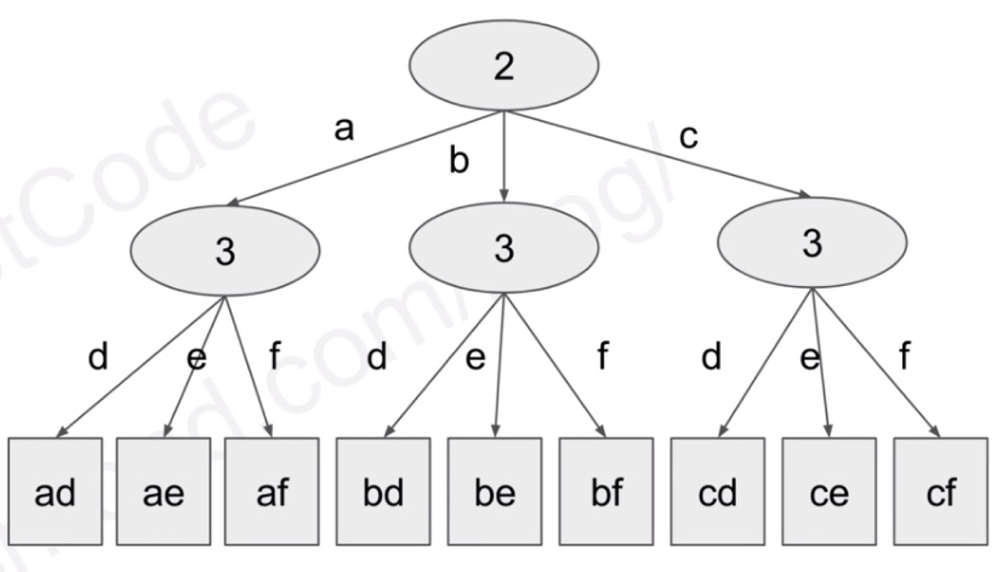

# ARTS13-20190207

# Algorithm 

### OJ address

Leetcode website : [17. Letter Combinations of a Phone Number](https://leetcode.com/problems/letter-combinations-of-a-phone-number/)

### Description

Given a string containing digits from 2-9 inclusive, return all possible letter combinations that the number could represent.

A mapping of digit to letters (just like on the telephone buttons) is given below. Note that 1 does not map to any letters.


Example:

Input: "23"
Output: ["ad", "ae", "af", "bd", "be", "bf", "cd", "ce", "cf"].

<!-- more -->

### My Solution in C

```c
#include <stdio.h>
#include <stdlib.h>
#include <string.h>

int indexValue = 0;

void dfs(const char *s ,char** letter_matrix, int count, int n, char **returnArray, char *newArray);

char** letterCombinations(char* digits, int* returnSize) {
    if (!strlen(digits)) {
        *returnSize = 0;
        return 0;
    }
    indexValue = 0;
    char *letter_matrix[10];
    letter_matrix[0] = " ";
    letter_matrix[1] = " ";
    letter_matrix[2] = "abc";
    letter_matrix[3] = "def";
    letter_matrix[4] = "ghi";
    letter_matrix[5] = "jkl";
    letter_matrix[6] = "mno";
    letter_matrix[7] = "pqrs";
    letter_matrix[8] = "tuv";
    letter_matrix[9] = "wxyz";
    char *s = malloc(sizeof(char) * strlen(digits));
    memset(s, '\0', strlen(digits));
    int j =0;
    for (int i=0;digits[i]!='\0';++i) {
        if (digits[i]== '0' || digits[i] == '1') continue;
        s[j++] = digits[i];
    }
    s[j] = '\0';
    int n = strlen(s);
    if (!n) {
        *returnSize = 0;
        return 0;
    }
    int sum = 1;
    for (int i=0;i<n;++i) {
        if (s[i] == '7' || s[i] == '9') {
            sum *=4;
            continue;
        }
        sum *=3;
    }
    *returnSize = sum;
    char **returnArray = malloc(sizeof(char *) * sum + 10);
    memset(returnArray, '\0', sizeof(char *) * sum + 10);
    char* newArray = malloc(sizeof(char) * (n+1) );
    dfs(s, letter_matrix, 0, n, returnArray, newArray);
    return returnArray;
}

void dfs(const char *s ,char** letter_matrix, int count, int n, char **returnArray, char *newArray) {
    if (count == n) {
        newArray[count] = '\0';
        char* array = malloc(sizeof(char) * (n+1) );
        memcpy(array, newArray, n);
        array[count] = '\0';
        returnArray[indexValue++] = array;
        return;
    }
    int len = strlen(letter_matrix[s[count]-'0']);
    for(int i=0;i<len;++i) {
        newArray[count] = letter_matrix[s[count]-'0'][i];
        dfs(s, letter_matrix, count+1, n, returnArray, newArray);
    }
}

int main(int argc, char const *argv[])
{
    char *s = "8\0";
    int *returnsize = malloc(sizeof(int)*1000);
    char **dd = letterCombinations(s,returnsize);
    for(int i=0;i<*returnsize;++i) {
        printf("%s\n", dd[i]);
    }
    return 0;
}
```

### Others Solution in C++ DFS

```c++
class Solution {
public:
    vector<string> letterCombinations(string digits) {
        if (digits.empty()) return {};
        
        vector<vector<char>> d(10);
        d[0] = {' '};
        d[1] = {};
        d[2] = {'a','b','c'};
        d[3] = {'d','e','f'};
        d[4] = {'g','h','i'};
        d[5] = {'j','k','l'};
        d[6] = {'m','n','o'};
        d[7] = {'p','q','r','s'};
        d[8] = {'t','u','v'};
        d[9] = {'w','x','y','z'};
        string cur;
        vector<string> ans;
        dfs(digits, d, 0, cur, ans);
        return ans;
    }
private:
    void dfs(const string& digits, 
             const vector<vector<char>>& d, 
             int l, string& cur, vector<string>& ans) {
        if (l == digits.length()) {
            ans.push_back(cur);
            return;
        }
        
        for (const char c : d[digits[l] - '0']) {
            cur.push_back(c);
            dfs(digits, d, l + 1, cur, ans);
            cur.pop_back();
        }
    }
};
```

### Others Solution in C++ BFS

```c++
class Solution {
public:
    vector<string> letterCombinations(string digits) {
        if (digits.empty()) return {};
        
        vector<vector<char>> d(10);
        d[0] = {' '};
        d[1] = {};
        d[2] = {'a','b','c'};
        d[3] = {'d','e','f'};
        d[4] = {'g','h','i'};
        d[5] = {'j','k','l'};
        d[6] = {'m','n','o'};
        d[7] = {'p','q','r','s'};
        d[8] = {'t','u','v'};
        d[9] = {'w','x','y','z'};
        vector<string> ans{""};
        for (char digit : digits) {
            vector<string> tmp;
            for (const string& s : ans)
               for (char c : d[digit - '0'])
                    tmp.push_back(s + c);
            ans.swap(tmp);
        }
        return ans;
    }
};
```

### My Idea

Solution via DFS:

Time complexity: O(4^n), n is the length of the input without '0' and '1'.
Space complexity: O(4^n + n)

Solution via BS:

Time complexity: O(4^n)
Space complexity: O(4^n * 2)

I solve it via C language, it's so difficult than C++, because 'char' is not comfortbal than 'String', but I like resolve it by C. You can resolve it via DBS or BFS, the question is medium level.

The question check our programming about knowledge of DFS、BFS and double dimensional array. All of them deserve a AC.

ps: 花了我一上午的时间解答这道题，太久没玩DFS，手很生，以至于午餐时间都过了，题目不解决，吃饭都没心思。现在解决了，去吃午餐啦.争取今晚搞定一个ARPS.



# Review

[Who’s Afraid of Their Big Bad O?](https://medium.com/s/story/purity-culture-left-me-afraid-of-my-own-orgasm-e8a4abdb7b96)

Don't be afraid the topic of sex, sexual sin was so serious that we were told masturbation invited actual demons into our lives. so that kids married too young because they wanted to have sex, young women found themselves in abusive marriages. Teens and young adults never learned about healthy sex or even how to survive a basic heartbreak.

Author say: Forget dating at 16. I never experienced that freedom at all under my mother’s roof. Any dating I have done has generally been in secret, behind my mother’s back. Even two years ago, when she came to visit me and my daughter in Tennessee, I found myself pretending that I didn’t have a boyfriend at the time. I was nearly 35.

Purity culture allowed the fears of religious adults to wound and impair their kids.

You need the freedom to relax, and sexual freedom is not quickly or easily learned. many people believe our culture is long past the need for open, positive, and vulnerable conversations surrounding sex. We will always need these conversations because healthy sex requires freedom.

That’s why we need to keep having conversations about sexual freedom both in and out of the bedroom.


# Tips

Convert Dictionary to JSON in Swift4.2:

Sometimes it's necessary to print out server's response for debugging purposes. Here's a function I use:

```swift
extension Dictionary {
    var json: String {
        let invalidJson = "Not a valid JSON"
        do {
            let jsonData = try JSONSerialization.data(withJSONObject: self, options: .prettyPrinted)
            return String(bytes: jsonData, encoding: String.Encoding.utf8) ?? invalidJson
        } catch {
            return invalidJson
        }
    }

    func printJson() {
        print(json)
    }
}
```

or print dic directly

```swift
do {
    let jsonData = try JSONSerialization.data(withJSONObject: dic, options: .prettyPrinted)
    print (String(bytes: jsonData, encoding: String.Encoding.utf8) ?? 0)
} catch { }
```

看到这个方法感觉很简单，但是不知道多少iOS开发者，一直通过抓包的方式来查看网络请求的Json，或者在网站上进行转化，而不会通过打印日志的方式将Json按规范格式直接打印在控制台上面。

# Shares

总结一下今天看的国外公开课的内容，以及知识点。

# CS50's Mobile App Development with React Native (Lecture three)

### Lecture three: React, Props, State

这一节主要都是例子以及Demo，按照上课的顺序，将Code说下

###  Set

Set 集合的定义，constructor是构建起，类似init，初始化的传参。this相当于oc中的self.

arr.push(val) 在数组中插入val这个元素
arr.filter(x => x!==val) 过滤掉和val相同的value.
arr.includes(x) 是否包含x这个value
arr.length 返回数组长度.

这是讲解类的构造，Set类的功能是插入的元素，不能有相同的元素。

```js
// Set should maintain a list of unique values and should support add, delete, and inclusion
// It should also have the ability to get its size

class Set {
  constructor(arr) {
    this.arr = arr
  }

  add(val) {
    if (!this.has(val)) this.arr.push(val)
  }

  delete(val) {
    this.arr = this.arr.filter(x => x !== val)
  }

  has(val) {
    return this.arr.includes(val)
  }

  get size() {
    return this.arr.length
  }
}

const s = new Set([1,2,3,4,5])

// trying to add the same value shouldn't work
s.add(1)
s.add(1)
s.add(1)
console.log('s should have 5 members and actually has:', s.size)

console.log('s should contain 5:', s.has(5))

s.add(6)
console.log('s should contain 6:', s.has(6))
console.log('s should have 6 members and actually has:', s.size)

s.delete(6)
console.log('s should no longer contain 6:', !s.has(6))
console.log('s should have 5 members and actually has:', s.size)
```

### Class Extends

类扩展方法如下，通过类名后面增加extends.

```js
// We can also extend the native implementation of Set if we wanted to do something
// like log on addition or create new methods

class MySet extends Set {
  constructor(arr) {
    super(arr)
    this.originalArray = arr
  }

  add(val) {
    super.add(val)
    console.log(`added ${val} to the set!`)
  }

  toArray() {
    return Array.from(this)
  }

  reset() {
    return new MySet(this.originalArray)
  }
}

const s = new MySet([1,2,3,4,5])
s.add(6)
s.add(7)
console.log(s.toArray())

const reset = s.reset()
console.log(reset.toArray())
```

###  spread ...

定义：扩展运算符（ spread ）是三个点（...）。它好比 rest 参数的逆运算，将一个数组转为用逗号分隔的参数序列。

将数组转化为遍历的元素，举例说明：

```javascript
console.log(...[1, 2, 3])
// 1 2 3
console.log(1, ...[2, 3, 4], 5)
// 1 2 3 4 5
[...document.querySelectorAll('div')]
```

可以将数组转化为函数体的参数

```javascript
function push(array, ...items) {
    array.push(...items);
}
function add(x, y) {
    return x + y;
}
var numbers = [4, 38];
add(...numbers) // 42
```

扩展运算符与正常的函数参数可以结合使用，非常灵活

```javascript
function f(v, w, x, y, z) { }
var args = [0, 1];
f(-1, ...args, 2, ...[3]);
```

扩展运算符内部调用的是数据结构的 Iterator 接口，因此只要具有 Iterator 接口的对象，都可以使用扩展运算符，比如 Map 结构：

```javascript
let map = new Map([
    [1, 'one'],
    [2, 'two'],
    [3, 'three'],
]);
let arr = [...map.keys()]
```

###  .map()

From the classic forloop to the forEach() method, various techniques and methods used to iterate through datasets abound JavaScript. However, one of the more popular methods is the .map() method

.map() 类似foreach的枚举，就是讲数组中的每个元素执行一个特定的方法。

举例说明：

```javascript
const sweetArray = [2, 3, 4, 5, 35]
const sweeterArray = sweetArray.map(sweetItem => {
    return sweetItem * 2
})

console.log(sweeterArray) // [4, 6, 8, 10, 70]
```

This can even be simplified further to make it cleaner with:


```javascript
// create a function to use
const makeSweeter = sweetItem => sweetItem * 2;

// we have an array
const sweetArray = [2, 3, 4, 5, 35];

// call the function we made. more readable
const sweeterArray = sweetArray.map(makeSweeter);

console.log(sweeterArray); // [4, 6, 8, 10, 70]
```

还可以Converting a String to an Array，类似 .split()功能

举个栗子：

```javascript
const name = "Chuloo"
const map = Array.prototype.map

const newName = map.call(name, eachLetter => {
    return `${eachLetter}a`
})

console.log(newName) // ["Ca", "ha", "ua", "la", "oa", "oa"]
```
Here's a good example of a React component.

Rendering Lists in JavaScript Libraries, for instance:

```javascript
import React from "react";
import ReactDOM from "react-dom";

const names = ["john", "sean", "mike", "jean", "chris"];

const NamesList = () => (
  <div>
    <ul>{names.map(name => <li key={name}> {name} </li>)}</ul>
  </div>
);

const rootElement = document.getElementById("root");
ReactDOM.render(<NamesList />, rootElement);
```

How about handling objects in an array? 就是对象在数组中的遍历应用。

```javascript
const myUsers = [
    { name: 'chuloo', likes: 'grilled chicken' },
    { name: 'chris', likes: 'cold beer' },
    { name: 'sam', likes: 'fish biscuits' }
]

const usersByFood = myUsers.map(item => {
    const container = {};

    container[item.name] = item.likes;
    container.age = item.name.length * 10;

    return container;
})
console.log(usersByFood);
// [{chuloo: "grilled chicken", age: 60}, {chris: "cold beer", age: 50}, {sam: "fish biscuits", age: 30}]
```

###  React‘s example

下面这个也是讲解的一个例子，这个用到了JSX的一些特性，.map()，以及扩展运算...都有用到，是个理解React 很好的例子，可以通过 https://codesandbox.io 直接运行查看网页显示。

```javascript
import React from 'react';
import { render } from 'react-dom';

let id = 0

const Todo = props => (
  <li>
    <input type="checkbox" checked={props.todo.checked} onChange={props.onToggle} />
    <button onClick={props.onDelete}>delete</button>
    <span>{props.todo.text}</span>
  </li>
)

class App extends React.Component {
  constructor() {
    super()
    this.state = {
      todos: [],
    }
  }

  addTodo() {
    const text = prompt("TODO text please!")
    this.setState({
      todos: [
        ...this.state.todos,
        {id: id++, text: text, checked: false},
      ], 
    })
  }

  removeTodo(id) {
    this.setState({
      todos: this.state.todos.filter(todo => todo.id !== id)
    })
  }

  toggleTodo(id) {
    this.setState({
      todos: this.state.todos.map(todo => {
        if (todo.id !== id) return todo
        return {
          id: todo.id,
          text: todo.text,
          checked: !todo.checked,
        }
      })
    })
  }

  render() {
    return (
      <div>
        <div>Todo count: {this.state.todos.length}</div>
        <div>Unchecked todo count: {this.state.todos.filter(todo => !todo.checked).length}</div>
        <button onClick={() => this.addTodo()}>Add TODO</button>
        <ul>
          {this.state.todos.map(todo => (
            <Todo
              onToggle={() => this.toggleTodo(todo.id)}
              onDelete={() => this.removeTodo(todo.id)}
              todo={todo}
            />
          ))}
        </ul>
      </div>
    )
  }
}


render(<App />, document.getElementById('root'));
```

That's all.


