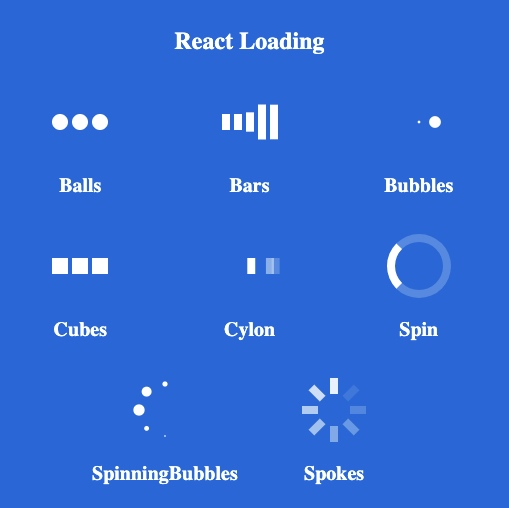
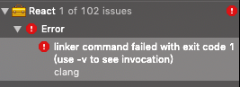
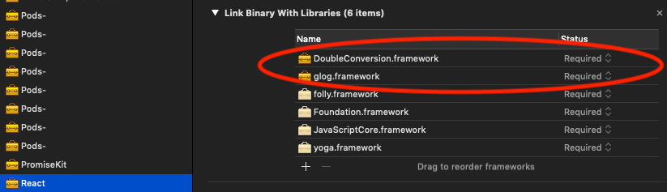
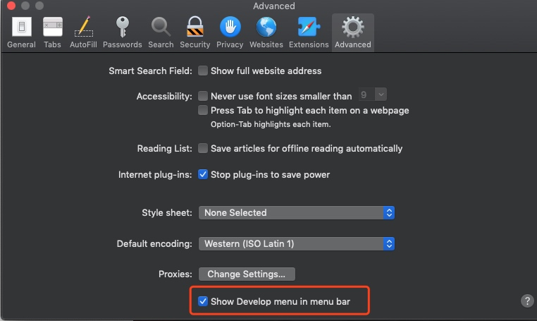
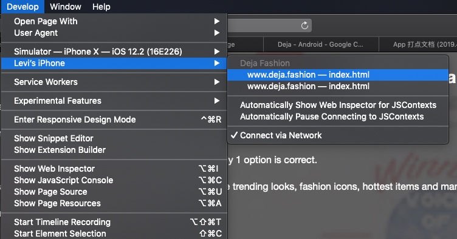
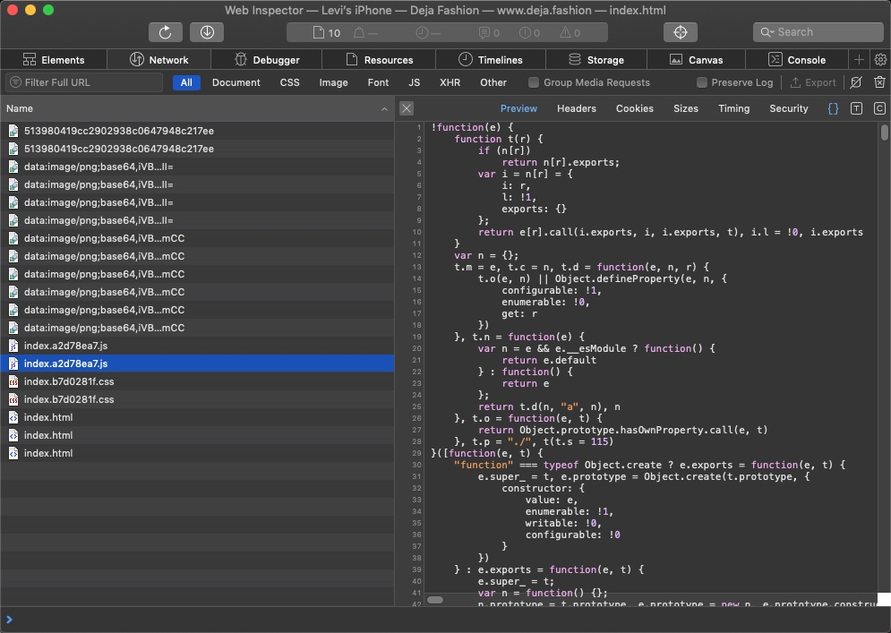

# ARTS15-20190407

# Algorithm 

### OJ address

website : [《剑指offer》数组中出现次数超过一半的数字](https://www.nowcoder.com/ta/coding-interviews?page=2)

### Description

数组中有一个数字出现的次数超过数组长度的一半，请找出这个数字。例如输入一个长度为9的数组{1,2,3,2,2,2,5,4,2}。由于数字2在数组中出现了5次，超过数组长度的一半，因此输出2。如果不存在则输出0。

### Solution in C++ (one solution)

```c++
class Solution {
public:
    int MoreThanHalfNum_Solution(vector<int> numbers) {
        int n = numbers.size();
        if (n==0) return 0;
        sort(numbers.begin(), numbers.end());
        int mid = numbers[n/2];
        int count = 0;
        for (int i=0;i<n;++i) {
        	if (numbers[i] == mid) ++count;
        }
        if (count*2 > n) return mid;
        return 0;
    }
};
```

### Solution in C++ (two solution)

```c++
class Solution {
public:
    int MoreThanHalfNum_Solution(vector<int> numbers) {
        int n = numbers.size();
        if (n==0) return 0;
        int num = numbers[0];
        int count = 1;
        for (int i=0;i<n;++i) {
        	if (numbers[i] == num) ++count;
        	else --count;
        	if (count == 0) {
        		num = numbers[i];
        		count = 1;
        	}
        }
        count = 0;
        for (int i=0;i<n;++i) {
        	if (numbers[i] == num) ++count;
        }
        if (count*2 > n) return num;
        return 0;
    }
};
```

### My Idea

Solution one ： 数组排序后，如果符合条件的数存在，则一定是数组中间那个数（比如：1，2，2，2，3；或2，2，2，3，4；或2，3，4，4，4等等）

Solution two ： 采用阵地攻守的思想：

1. 第一个数字作为第一个士兵，守阵地；count = 1；
2. 遇到相同元素，count++;
3. 遇到不相同元素，即为敌人，同归于尽,count--；当遇到count为0的情况，又以新的i值作为守阵地的士兵，继续下去，到最后还留在阵地上的士兵，有可能是主元素。
4. 再加一次循环，记录这个士兵的个数看是否大于数组一般即可


# Review

[You Could Have Today. Instead You Choose Tomorrow.](https://medium.com/s/story/you-could-have-today-instead-you-choose-tomorrow-4cb5ac429a5a)

Don't expect to having a better tomorrow，today could be how you want life to be."You could be good today," the Roman emperor Marcus Aurelius wrote. "But instead you choose tomorrow."

# Tips

## 1. H5 react增加loading页面

1. 安装插件:

```
npm i react-loading  --save
```

npm web:
https://www.npmjs.com/package/react-loading

2. Demo展示页面: 

https://codesandbox.io/s/mqx0ql55qp

3. 使用方法:

```html
<ReactLoading type='spokes' color="#262729" height="0.3rem" width="0.3rem"/>
```

4. loading样式: 



5. 模拟iOS loading样式:

html:

```html
<div className="SnsRankOther-loadingPic">
    <ReactLoading type='spokes' color="#262729" height="0.3rem" width="0.3rem"/>
</div>
```

css:

```css
.SnsRankOther-loadingPic {
    background: rgba(230, 230, 230, 0.479);
    width: 0.8rem;
    height: 0.8rem;
    border-radius: 0.05rem;
    display: flex;
    flex-direction: row;
    align-items: center;
    justify-content: center;
}
```

效果:


## 2. iOS pod update后React framework报错

问题出现: npm install 后 podupdate， Xcode运行报错，错误提示 React google::logmessage出题。

1. 编译报错提示：



log:

```
Undefined symbols for architecture x86_64:
  "google::LogMessage::LogMessage(char const*, int, int)", referenced from:
      facebook::react::CxxNativeModule::invoke(unsigned int, folly::dynamic&&, int)::$_1::operator()() const in CxxNativeModule.o
      facebook::react::JSException::buildMessage(OpaqueJSContext const*, OpaqueJSValue const*, OpaqueJSString*, char const*) in JSCHelpers.o
  "double_conversion::DoubleToStringConverter::ToShortestIeeeNumber(double, double_conversion::StringBuilder*, double_conversion::DoubleToStringConverter::DtoaMode) const", referenced from:
      double_conversion::DoubleToStringConverter::ToShortest(double, double_conversion::StringBuilder*) const in CxxNativeModule.o
  "double_conversion::DoubleToStringConverter::ToFixed(double, int, double_conversion::StringBuilder*) const", referenced from:
      std::__1::enable_if<(std::is_floating_point<double>::value) && (IsSomeString<std::__1::basic_string<char, std::__1::char_traits<char>, std::__1::allocator<char> > >::value), void>::type folly::toAppend<std::__1::basic_string<char, std::__1::char_traits<char>, std::__1::allocator<char> >, double>(double, std::__1::basic_string<char, std::__1::char_traits<char>, std::__1::allocator<char> >*, double_conversion::DoubleToStringConverter::DtoaMode, unsigned int) in CxxNativeModule.o
      ...
```

2. 解决方案:

working manually adding DoubleConversion and glog to Link Binary With Libraries of React framework target in @CocoaPods project.



## 3. UITableView回滚到顶部的几种方法

问题: tableview每次回滚是滚到了第一个cell上面，但这个tableview是有表头的。

看了下代码:

```swift
self.tableview.scrollToRow(at: IndexPath(row: 0, section: 0), at: .top, animated: true)
```

改成如下方式:

```swift
self.contentTB.setContentOffset(CGPoint(x: 0, y: 0), animated: true)
```

问题解决

UITableView回滚到顶部的几个方法：

```
    //方法一
    [self.tableView  scrollRectToVisible:CGRectMake(0, 0, 1, 1) animated:NO];


    //方法二
    [self.tableView setContentOffset:CGPointMake(0,0) animated:NO];

    //方法三
    NSIndexPath* indexPat = [NSIndexPath indexPathForRow:0 inSection:0];
   [self.tableView scrollToRowAtIndexPath:indexPat atScrollPosition:UITableViewScrollPositionBottom animated:YES];
```

方法一可以回滚到表头，其他两个方法只是回滚到第一个cell.

## 4. iOS通过Safari调试H5

1. 通过数据线，将手机连接电脑

2. 打开手机， Settings - safari - Advanced - Web Inspector 开关打开

3. 打开电脑safari，preference - Advanced - Show Develop menu in menu bar 开关打开,如图:



4. 打开电脑safari - Develop bar 中会看到你的手机，如图所示，点击进行调试:




5. 点击web后进入了调试页面，可以进行调试了。



## 5. JavaScript 获取时间戳转换美国日期简写的方法：

需求: 通过服务端传时间戳显示页面如下:


代码如下, request.data.start_date为时间戳类型，通过js方法转换成美国日期简写的正确的方式

```javascript
let startDate = new Date(request.data.start_date);
let startMonth = startDate.toDateString().split(" ")[1]
let startDay = startDate.toDateString().split(" ")[2] + 'th'
var date = new Date(request.data.end_date);
let endDate = new Date(request.data.end_date);
let endMonth = endDate.toDateString().split(" ")[1]
let endDay = endDate.toDateString().split(" ")[2] + 'th'
dateText = startDay + ' ' + startMonth + ' - ' + endDay + ' ' + endMonth    
```

## 6. iOS倒计时方法：

效果如下:


代码如下

```swift
internal var timer: Timer!
    public var timeFormat = "HH:mm:ss"
    internal var diffDate: NSDate!
    internal let date1970 = NSDate(timeIntervalSince1970: 0)
    internal var fromDate: NSDate = NSDate()
    internal var currentDate: NSDate = NSDate()
    internal var range: NSRange!
    internal var targetTime: TimeInterval = 0
    internal var currentTime: TimeInterval = 0
    internal var endOfTimer: Bool {
        return timeCounted >= currentTime
    }
    
    
public var timeCounted: TimeInterval {
    let timeCounted = NSDate().timeIntervalSince(fromDate as Date)
    return round(timeCounted < 0 ? 0 : timeCounted)
}
  
public var dateFormatter: DateFormatter {
    let df = DateFormatter()
    df.locale = Locale(identifier: "zh_CN")
    df.dateStyle = DateFormatter.Style.medium
    df.timeStyle = DateFormatter.Style.medium
    df.dateFormat = timeFormat
    return df
}  
    
func updateTimer() {
    disposeTimer()
    timer = Timer.scheduledTimer(timeInterval: 1.0,
                                 target: self,
                                 selector: #selector(updateText),
                                 userInfo: nil,
                                 repeats: true)
    RunLoop.current.add(timer, forMode: RunLoop.Mode.common)
}
    
func disposeTimer() {
    if timer != nil {
        timer.invalidate()
        timer = nil
    }
}

func updateText() {
    guard diffDate != nil else { return }
    
    let date = diffDate.addingTimeInterval(round(timeCounted * -1)) as Date
    let formattedText = timeCounted < 0
        ? dateFormatter.string(from: date1970.addingTimeInterval(0) as Date)
        : self.surplusTime(date)
    
    countdownLabel.text = " - Result will be revealed in " + formattedText
    countdownLabel.sizeToFit()
    
    setNeedsDisplay()
    
    if endOfTimer {
        disposeTimer()
        countdownLabel.text = " "
        countdownLabel.sizeToFit()
    }
}
    
func surplusTime(_ to1970Date: Date) -> String {
    let calendar = Calendar.init(identifier: .gregorian);
    var labelText = timeFormat;
    let comp = calendar.dateComponents([.day, .hour, .minute, .second], from: NSDate(timeIntervalSince1970: 0) as Date, to: to1970Date)
    
    if let day = comp.day ,let _ = timeFormat.range(of: "dd"){
        labelText = labelText.replacingOccurrences(of: "dd", with: String.init(format: "%02ld", day))
    }
    if let hour = comp.hour ,let _ = timeFormat.range(of: "hh"){
        labelText = labelText.replacingOccurrences(of: "hh", with: String.init(format: "%02ld", hour))
    }
    if let hour = comp.hour ,let _ = timeFormat.range(of: "HH"){
        labelText = labelText.replacingOccurrences(of: "HH", with: String.init(format: "%02ld", hour))
    }
    if let minute = comp.minute ,let _ = timeFormat.range(of: "mm"){
        labelText = labelText.replacingOccurrences(of: "mm", with: String.init(format: "%02ld", minute))
    }
    if let second = comp.second ,let _ = timeFormat.range(of: "ss"){
        labelText = labelText.replacingOccurrences(of: "ss", with: String.init(format: "%02ld", second))
    }
    return labelText
} 
```

## 7. HTML5 写 REM.js文件方法

1. 复制下面这段代码到你的页面的头部的script标签的最前面。如果是react js，直接放在index.js文件里：

```javascript
import './rem.js'
```

2. 根据设计稿大小，调整里面的最后两个参数值。

3. 使用1rem=100px转换你的设计稿的像素，例如设计稿上某个块是100px * 300px,换算成rem则为1rem * 3rem。


```javascript
var win = window;
var doc = win.document;
var docEl = doc.documentElement;
var tid;

function refreshRem(){
    var width = docEl.clientWidth;
    var height = docEl.clientHeight;
    if(width>=640){
        docEl.style.fontSize = '100px';
    }else{
        docEl.style.fontSize = 100 * (width / 375) + 'px';
    }
}

win.addEventListener('resize', function() {
    clearTimeout(tid);
    tid = setTimeout(refreshRem, 300);
}, false);
win.addEventListener('pageshow', function(e) {
    if (e.persisted) {
        clearTimeout(tid);
        tid = setTimeout(refreshRem, 300);
    }
}, false);

refreshRem();
```


# Shares - React.js/html5和iOS双向通信

最近，我使用WKWebView和React.js进行双向通信,自己写了React.js嵌入到Native中。

## Native操作Web，通过两种方式传值

### 第一种，通过JS传值给Native

通过这种方式，可以通过Swift执行DOM操作，顺便说一句，webView.evaluateJavaScript返回脚本执行结果的内容。这个处理程序似乎是在主线程上执行的。

Native调用JS代码方法如下:

```swift
let str = "payResult(true)"
    webView.evaluateJavaScript(str) { (result, error) in
}
```

Javascript处理逻辑方法如下:

```javascript
payResult = value => {
    if (value === true) {
        console.log('true')
        this.setState(prevState => ({
            pushnotice: '1'
        }));
        
    }
    else {
        console.log('false')
        this.setState(prevState => ({
            pushnotice: '0'
        }));
    }
}
```

如果JS的payResult方法没有调用，那就加上这样一句话window.payResult，有可能被组件屏蔽无法全局调用。

```javascript
constructor(props) {
    super(props);
    window.payResult = this.payResult
}
```

### 第二种，通过get请求传值

通过get请求方式将参数传到js的请求URL链接中。

```swift
var url = ""
if let webUrl = webUrl {
    url = webUrl
    if let uid = userID {
        url += "?" + "uid=" + uid
    }
    if let topicId = topicId {
        url += "&" + "topic=" + topicId
    }
    if isRank == true {
        url += "&" + "type=2"
    }
}
```

react.js通过URL拼接方式解析传递的参数,方法如下:

```javascript
var params = {}
let str = this.props.location.search
let seg = str.replace(/^\?/, '').split('&')
let len = seg.length
for (var i = 0; i < len; i++) {
    if (seg[i]) {
       let p = seg[i].split('=');
       params[p[0]] = p[1];   
    }
}
```

通过这种方式params.uid | param.topic | param.type 来获取参数

## Native操作Web，通过两种方式传值

### Native操作

1. 实例化 WKWebViewConfiguration和WKUserContentController,userController在JavaScript的注册处理调用名称。并设置实现WKScriptMessageHandler协议的代理。

```swift
let webConfiguration = WKWebViewConfiguration()
webConfiguration.preferences = WKPreferences()
webConfiguration.preferences.minimumFontSize = 10;
webConfiguration.preferences.javaScriptEnabled = true;
webConfiguration.preferences.javaScriptCanOpenWindowsAutomatically = false;
webConfiguration.userContentController = WKUserContentController()
webConfiguration.processPool = WKProcessPool()
webConfiguration.userContentController.add(self as WKScriptMessageHandler, name:"pushAction")

let webView = WKWebView(frame: .zero, configuration: webConfiguration)
webView.scrollView.bounces = false
webView.scrollView.showsVerticalScrollIndicator = false
webView.scrollView.showsHorizontalScrollIndicator = false
```

2. 通过WKScriptMessageHandler协议进行监控

```swift
func userContentController(_ userContentController: WKUserContentController, didReceive message: WKScriptMessage) {
    print(message.name)
    print(message.body)
    jsInvokeNativeHandler(message)
}

func jsInvokeNativeHandler(_ message: WKScriptMessage) {
    if message.isKind(of: WKScriptMessage.self) {
        let serialQueue = DispatchQueue(label: "com.test.mySerialQueue")
        serialQueue.sync {
            if message.name == "pushAction" {
                if let dict : NSDictionary = message.body as? NSDictionary {
                     if let content = dict["content"] as? String {
                        self.sendPushNotification(content)
                    }
                }
            }
    }
}

```

关于解析，和Web进行协议，我在H5写的代码通过message传过来的是一个字典类型 {content: '...'}。

### web端操作 

H5如何传递方法给native？

传值方法如下，iOS和Android接受的方法不同，要单独进行处理:

```javascript
window.htmlCallMobileDeja = function(handlerMethod, parameters){    

    try {
        var u = navigator.userAgent; 
        var isAndroid = u.indexOf('Android') > -1 || u.indexOf('Adr') > -1 
        var isiOS = !!u.match(/\(i[^;]+;( U;)? CPU.+Mac OS X/) 
        if (isiOS) {
            if (window.webkit) {
                window.webkit.messageHandlers[handlerMethod].postMessage(dic);
                console.log(handlerMethod)
            }
        } else if(isAndroid){
            window['JsClient'][handlerMethod](parameters)
        }
        else {
            //
        }
    } catch(err) {
        console.log('The native context does not exist yet');
    }
};
```

javascript通过这种方式进行传值

```javascript
var dic = {
    'event_name': event_name + '',
    'event_first_param': event_first_param + '',
    'event_second_param': event_second_param + '',
}
window.htmlCallMobileDeja('hideMBP', dic)
```


